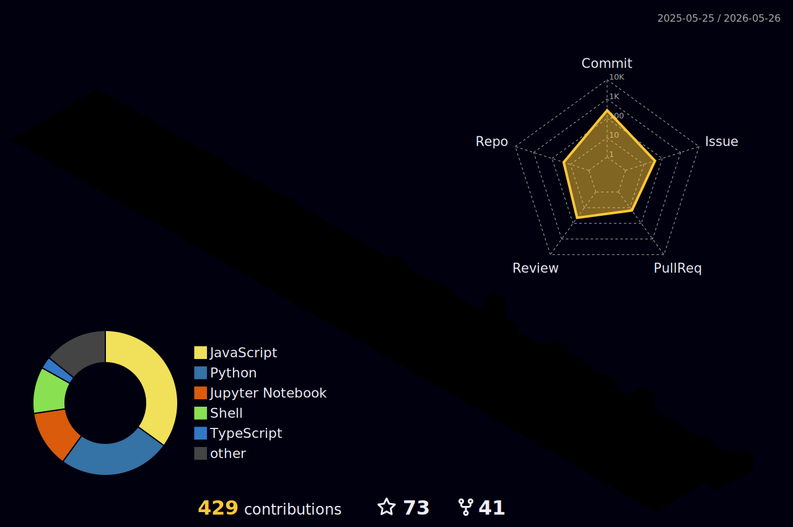

<h3 align="center">A passionate MERN Stack Developer From India</h3>

- 🔭 I'm currently working on **VaxTrust**

- 🌱 I'm currently learning **Data Science, Fullstack Developement**

- 👨‍💻 All of my projects are available at [https://shreyasmene.in](https://shreyasmene.in)

- 💬 Ask me about **React, MongoDB, etc.**

- 📫 How to reach me **shreyasmene6@gmail.com**

- ⚡ Fun fact **I think I am Funny**

<h3 align="left">Connect with me:</h3>

    

  

  <table>
    <tr>
      <td align="center">
        
      </td>
      <td align="center">
        
      </td>
    </tr>
  </table>

  

  

### 📈 3D Contribution Calendar

  

### 🎨 Featured Projects

<table>
  <tr>
    <td align="center" width="50%">
      
    </td>
    <td align="center" width="50%">
      
    </td>
  </tr>
  <tr>
    <td align="center" width="50%">
      
    </td>
    <td align="center" width="50%">
      
    </td>
  </tr>
  <tr>
    <td align="center" width="50%">
      
    </td>
    <td align="center" width="50%">
      
    </td>
  </tr>
  <tr>
    <td align="center" width="50%">
      
    </td>
    <td align="center" width="50%">
      
    </td>
  </tr>
</table>

<h3 align="left">Languages and Tools:</h3>

                      

  

